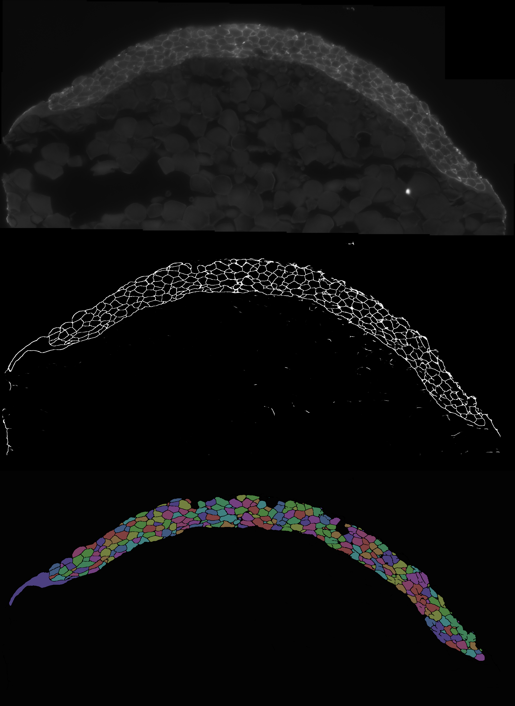

<!-- 
 -->
<!-- style="transform:rotate(90deg);" -->

<!-- 
 -->

## About

This method performs automatic pixelwise membrane labeling and cell instance segmentation in 2D cross-sections of Zebrafish embryos labeled with smFISH. 

For information about the sample preparation and imaging involved in
creating the data please see [Stapel et al](#f1).

## Methods

Membrane pixelwise classification is performed with a 5-layer
[U-Net](https://arxiv.org/pdf/1505.04597.pdf) modified from
[retinal blood vessel segmentation](https://github.com/orobix/retina-unet).

## Dependencies

You need Python3 with the standard scientific python libraries:
numpy, scipy, scikit-learn and scikit-image the deep learning framework
Keras which uses as backend: Tensorflow or Theano

# Footnotes

<a name="f1">[Stapel et al]:</a>  
Stapel, L. Carine, et al. "Automated detection and quantification of single RNAs at cellular resolution in zebrafish embryos."Development 143.3 (2016): 540-546.
