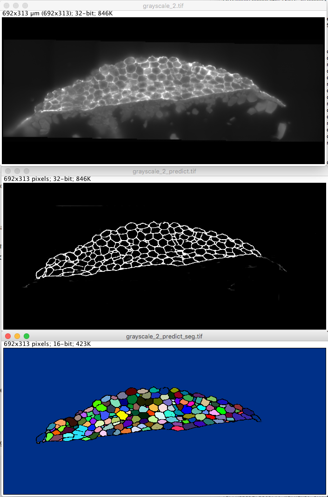

# Readme

Performs automatic pixelwise membrane labeling and cell segmentation in 2D fluorescence microscopy images of early embryos.

Pic is worth 10^3 words:

## About

For information about the sample preparation and imaging involved in
creating the data please see [Stapel et al](#f1).

## Methods

Membrane pixelwise classification is performed with a 5-layer
(2-downsampling, 1-bottom, 2-upsampling)
[U-Net](https://arxiv.org/pdf/1505.04597.pdf) modified from
[retinal blood vessel segmentation](https://github.com/orobix/retina-unet).

## Installation

You need Python3 with the standard scientific python libraries:
numpy, scipy, scikit-learn and scikit-image the deep learning framework
Keras which uses as backend: Tensorflow or Theano

## Usage

TBD

# Footnotes

<a name="f1">
[Stapel et al]:

Stapel, L. Carine, et al. "Automated detection and quantification of single RNAs at cellular resolution in zebrafish embryos."Development 143.3 (2016): 540-546.
</a>
